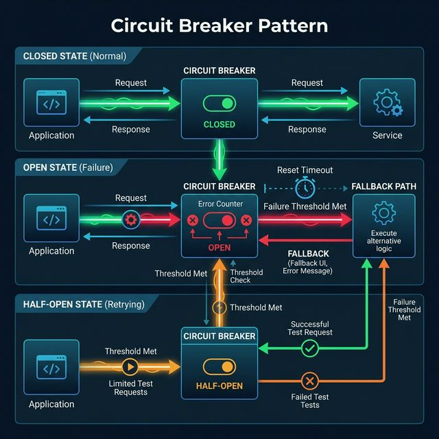

# Circuit Breaker Pattern

In a microservices architecture, services make dozens of network calls to each other. A network call can fail. This is not an opinion — it is a physical certainty. The fundamental question is: **what happens to the rest of the system when a downstream service collapses?**

Without protection, a failing downstream service causes the calling service to pile up threads waiting for responses that will never arrive, eventually crashing an otherwise healthy service. This is the **Cascading Failure** problem.

The **Circuit Breaker Pattern**, borrowed directly from the world of electrical engineering, is the solution.

## How an Electrical Circuit Breaker Works (The Analogy)

In your home, if too much current flows through a wire (a short circuit), the circuit breaker "trips" — it opens the circuit and cuts the electricity before the wire melts and burns your house down. Once the fault is fixed, you manually reset ("close") the breaker and electricity flows again.

Software Circuit Breakers work identically.

## The Three States of a Software Circuit Breaker

A Circuit Breaker wraps every external service call and maintains an internal **state machine** with three states:

### State 1: CLOSED (Normal Operation)
Requests flow through to the downstream service normally. The Circuit Breaker silently monitors every call and tracks a rolling **failure rate** (e.g., errors in the last 10 seconds). The circuit is "closed" — electricity is flowing.

### State 2: OPEN (Failure Detected)
When the failure rate crosses a configured threshold (e.g., 50% of the last 20 calls failed), the Circuit Breaker **trips open**. It immediately stops forwarding any new requests to the broken downstream service (for a configured sleep window, e.g., 30 seconds). Instead, it returns a fast, pre-configured **fallback response** to the caller instantly. The key insight: **no request even touches the broken service** — we fail fast.

### State 3: HALF-OPEN (Recovery Probe)
After the sleep window expires, the Circuit Breaker cautiously allows **one single trial request** through to the downstream service to probe if it has recovered.
- If that trial request **succeeds** → the breaker transitions back to **CLOSED** and normal operation resumes.
- If that trial request **fails** → the breaker immediately flips back to **OPEN** and restarts the sleep timer.

### State Machine Visualized:
```text
              [ All good ]          [ Failure rate > threshold ]
   ┌──────────────────────────────────────────────────────┐
   │                                                      │
   v                                                      │
[ CLOSED ] ──── failure rate exceeds threshold ────> [ OPEN ]
   ^                                                      │
   │                                                      │ sleep window expires
   │                                                      v
   │                                               [ HALF-OPEN ]
   │                                                      │
   └─────────────── trial request succeeds ───────────────┘
                    trial request fails ──────────> back to [ OPEN ]
```

## Full System Architecture

### ❌ WITHOUT a Circuit Breaker — The Problem

```text
  Step 1: Your app sends a request to the Payment Service
  ┌──────────────┐       asks for payment        ┌─────────────────────┐
  │   Your App   │ ─────────────────────────────► │  Payment Service    │
  │              │                                │  ❌ CRASHED / SLOW  │
  └──────────────┘                                └─────────────────────┘
          │                                               │
          │  ⏳ Your app is now WAITING...                │
          │  ⏳ Still waiting...                          │ (no response
          │  ⏳ 30 seconds pass...                        │  ever comes)
          │
  Step 2: More users send requests. Each request gets stuck waiting too.
          ┌──────────────┐
          │   Your App   │  ← threads piling up, memory filling up
          │  ⚠️ OVERLOADED│
          └──────────────┘
          │
  Step 3: YOUR app crashes too — because of someone else's problem!
          ┌──────────────┐
          │   Your App   │  ❌ NOW YOUR APP IS DOWN
          └──────────────┘
          │
  ONE broken service just took down a completely different service.
  This is called a "Cascading Failure".
```

---

### ✅ WITH a Circuit Breaker — The Solution

```text
  The Circuit Breaker sits between your app and the other service.
  Think of it as a smart security guard that watches every call.

  NORMAL (Circuit CLOSED — everything is fine):
  ┌──────────────┐  sends request  ┌─────────────────┐  forwards to  ┌───────────────────┐
  │   Your App   │ ──────────────► │ Circuit Breaker │ ────────────► │  Payment Service  │
  └──────────────┘                 │   ✅ CLOSED      │              │  ✅ Working fine   │
                                   └─────────────────┘              └───────────────────┘

  ─────────────────────────────────────────────────────────────────────────────────
  FAILURE (Circuit OPEN — too many errors detected):

  ┌──────────────┐  sends request  ┌─────────────────┐   ✋ STOPS   ┌───────────────────┐
  │   Your App   │ ──────────────► │ Circuit Breaker │  the call   │  Payment Service  │
  └──────────────┘                 │   ❌ OPEN        │ ──────────► │  ❌ CRASHED        │
          │                        └─────────────────┘             └───────────────────┘
          │                                │
          │       immediately returns      │
          │◄───────────────────────────────┘
          │  "Payment is down. Please retry in 1 minute."
          │  (returns in ~1 millisecond — your app stays healthy!)
          │
          ▼
  ✅ Your App stays up and serves users normally.
     Only the payment feature is temporarily unavailable.

  ─────────────────────────────────────────────────────────────────────────────────
  RECOVERY (Circuit HALF-OPEN — testing if the service is back):

  After 30 seconds, the Circuit Breaker sends ONE test request:
  ┌─────────────────┐  one test call  ┌───────────────────┐
  │ Circuit Breaker │ ───────────────► │  Payment Service  │
  │  ❓ HALF-OPEN   │                 │  ✅ Back online!   │
  └─────────────────┘ ◄─────────────── └───────────────────┘
          │               success!
          │
          ▼
  Circuit goes back to CLOSED. Everything works normally again.
```



**The big idea:** A Circuit Breaker stops your healthy services from being dragged down by a broken one. Only the broken feature goes down — everything else keeps running.


## The Fallback Response
When the breaker is OPEN, what does the caller return instead of erroring out? A **fallback**. The correct fallback depends on the business context:

| Broken Service       | Intelligent Fallback                                      |
|----------------------|-----------------------------------------------------------|
| Recommendation Engine | Return a static list of "Top 10 Best Sellers"           |
| User Profile Service | Return a cached version of the profile from Redis        |
| Payment Gateway      | Return HTTP 503 with "Payment system is temporarily down. Please retry in 1 minute." |
| Inventory Service    | Return "Stock check unavailable, item may be available"  |

The fallback prevents a broken **non-critical** dependency from destroying the user experience of the **primary** feature.

## Why This Is Brilliant: Fail Fast

Without a Circuit Breaker, calling a frozen service means each API thread **blocks for 30 seconds**, waiting for a TCP timeout. Under heavy load (1000 requests/sec), you instantly saturate the thread pool of the calling service with stuck threads. The calling service itself crashes.

With a Circuit Breaker in OPEN state, the call returns a fallback in **~1 millisecond**. Thread pools stay healthy. The healthy services remain healthy even while a dependency is burning.

*(Popular Tools: Netflix Hystrix (legacy), Resilience4j (Java), Polly (.NET), Istio/Envoy at the infrastructure level.)*

---

### Common HLD Interview Questions

**Q1: Why does the Circuit Breaker Pattern improve overall system resilience even when a downstream service is permanently down?**
*Answer:* Because it contains the blast radius of that failure. Without it, a single failing downstream service causes resource exhaustion (thread pool saturation) in every upstream service that calls it, spreading failure upward through the entire dependency chain. The Circuit Breaker isolates the fault and returns fallbacks instantly, allowing the healthy parts of the system to keep serving users normally.
*Example:* Netflix's Recommendation Service goes down. Without a Circuit Breaker, the Homepage Service's thread pool fills up with threads waiting for recommendation data, crashing the Homepage. With a Circuit Breaker, the Homepage Service detects the failure after 20 calls, opens the breaker, and immediately begins serving everyone a cached "Top 10 Movies" list, keeping the homepage 100% functional while the Recommendation team fixes their service.

**Q2: What is the purpose of the HALF-OPEN state, and why not just go directly from OPEN back to CLOSED after the sleep window?**
*Answer:* The HALF-OPEN state is a cautious recovery probe. Going directly from OPEN to CLOSED after a timed sleep would be dangerous — the downstream service may have restarted but could still be overloaded or only partially healthy. Sending a full flood of traffic directly at it could immediately re-crash it. The HALF-OPEN state sends **a single canary request** first. Only if that one request succeeds does the system conclude the downstream service is truly healthy and gradually restore full traffic, preventing the thundering herd problem on recovery.
