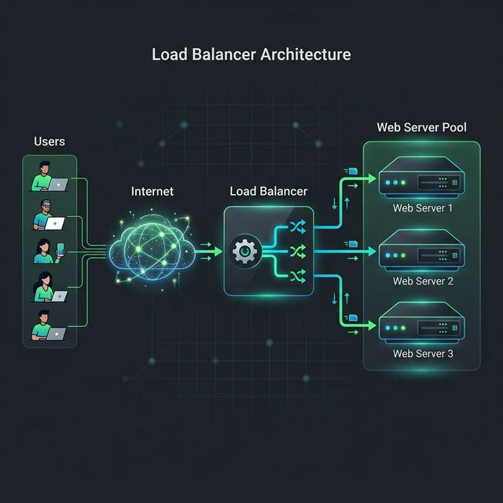

# Stage 4: Load Balancers

Once you decide to horizontally scale and add multiple app servers, you immediately face a new problem: **how does a user's request know which server to go to?** The answer is a **Load Balancer** — one of the most important components in all of distributed systems.

---
### What Is a Load Balancer?

A Load Balancer is a **traffic cop** that sits in front of your fleet of application servers. It receives all incoming requests and distributes them across healthy backend servers according to a defined algorithm.

The client **never knows** which backend server actually handled their request.

---

### Architecture Visualized

```text
          [ Users/Browsers/Mobile Apps ]
                      |
               (Single Public IP)
                      |
                      v
          +------------------------+
          |     LOAD BALANCER      |  ← Only public-facing component
          |  (e.g. AWS ALB, Nginx) |
          +------------------------+
           /          |          \
          v           v           v
  +-----------+ +-----------+ +-----------+
  | App Server| | App Server| | App Server|
  |     #1    | |     #2    | |     #3    |
  | (Private  | | (Private  | | (Private  |
  |    IP)    | |    IP)    | |    IP)    |
  +-----------+ +-----------+ +-----------+
           \         |          /
            \        v         /
           +--------------------+
           |    Database Server |
           +--------------------+
```



**Security Benefit:** App Servers now have **private IPs only** and are invisible to the public internet.

---

### Load Balancing Algorithms

1. **Round Robin:** Distributes requests in a circular sequence (#1, #2, #3, #1, #2, #3...). Best for identical servers.
2. **Least Connections:** Routes traffic to whichever server currently has the fewest active tasks. Best for long-running items.
3. **IP Hash (Sticky Sessions):** Hashes the client's IP address to map them always to the same server. Useful for legacy apps.
4. **Weighted Round Robin:** Sends more traffic to more powerful servers based on a pre-assigned "weight".

---

### Layer 4 vs Layer 7 Load Balancers

| Feature | Layer 4 (Transport) | Layer 7 (Application) |
|---|---|---|
| **Operates on** | IP address + Port | HTTP Headers, URL, Cookies |
| **Logic** | Faster (no inspection) | Smarter (content inspection) |
| **Can route based on** | "All port 443 traffic" | "/api to API servers, /img to Image servers" |
| **Example** | AWS NLB, HAProxy | AWS ALB, Nginx |

---

### Health Checks

The Load Balancer constantly pings backend servers (`GET /health`). If a server fails to respond, it is automatically removed from the rotation until it passes the check again.

```text
Load Balancer → /health → Server #1 → 200 OK   [YES] Healthy
Load Balancer → /health → Server #2 → Timeout  [NO] Unhealthy
Load Balancer → /health → Server #3 → 200 OK   [YES] Healthy

Result: Traffic is only sent to #1 and #3.
```

---

## Advantages

1. **Eliminates SPOF:** If one web server dies, traffic reroutes to healthy ones in seconds.
2. **Horizontal Scaling:** Add or remove servers seamlessly as traffic grows.
3. **SSL Termination:** Decrypt HTTPS at the LB once, use plain HTTP internally to save server CPU.
4. **Security:** Hide your internal server network behind one public entry point.
5. **Traffic Management:** Easily perform maintenance by draining connections from one server at a time.

---

## Disadvantages

1. **SPOF Risk:** If you only have one LB and it fails, the whole system dies. Use an "Active-Passive" setup.
2. **Latency:** Adds one extra network hop between the user and the application (~1ms).
3. **Cost:** Managed load balancers (AWS ALB) add to your monthly cloud bill.

---

### Common HLD Interview Questions

**Q1: Explain how a Load Balancer eliminates a Single Point of Failure.**
*Answer:* It uses health checks to monitor backend servers. If one fails, it's removed from the rotation immediately.
*Example:* During a "Flash Sale", Server #3 crashes due to high load. The Load Balancer detects this in 5 seconds and routes all new shoppers to Servers #1 and #2, so no one sees an error page.

**Q2: What is "sticky sessions" and when would you use it?**
*Answer:* It's a feature where the LB ensures a user always hits the same server. Use it only for legacy apps that store sessions in local memory.
*Example:* An old "Banking" portal from 2005 stores a user's login details in the server's local RAM. A Load Balancer must use IP hashing to keep that user on that specific server for their entire session.

**Q3: What is the difference between Layer 4 and Layer 7 load balancing?**
*Answer:* Layer 4 is fast and works at the network level; Layer 7 is smarter and works at the application heart.
*Example:* A "Streaming Service" uses a Layer 7 LB to route requests for `/watch` to a pool of high-bandwidth video servers, while routing `/premium` to a pool of secure payment servers.
s like game servers or real-time trading platforms, Layer 4's speed advantage is preferred.
