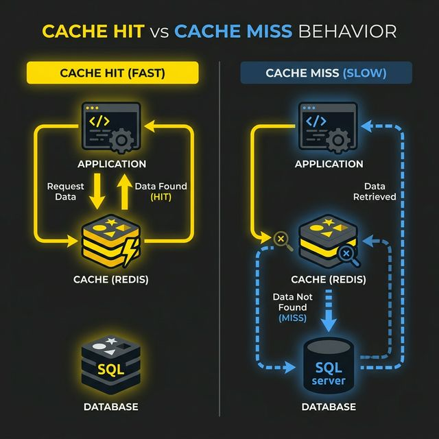

# Stage 6: Caching

Even with Read Replicas, your database is still handling massive read traffic. The next weapon in your scaling arsenal is **Caching** — storing frequently-accessed data in a fast, in-memory store so that most requests never even touch the database.

Caching is arguably the **single highest-impact optimization** you can make in a large-scale system.

---

### The Core Idea

```text
WITHOUT CACHING:
User requests "Top 10 Products" → App Server → Database Query (50ms) → Response

WITH CACHING:
User 1 requests "Top 10 Products" → Cache MISS → DB Query (50ms) → Store in Cache → Response
User 2 requests "Top 10 Products" → Cache HIT → Return from Cache (0.5ms) → Response [YES]
User 3, 4, 5... (same) → Cache HIT → 0.5ms → Response [YES]
```

If 1000 users request the same data, and the answer is in cache, your DB only runs the query **once**. 99.9% of the work is eliminated.



---

### Two Major Categories of Caching

#### Category 1: In-Memory Cache (Application-Level)

A dedicated in-memory store between your app servers and your database.

**Examples:** Redis, Memcached

- **Redis:** Rich data types (lists, hashes), persistence, native clustering. Default choice.
- **Memcached:** Simple key-value, very high speed, RAM-only. Good for simple object stores.

---

#### Category 2: CDN (Content Delivery Network)

A CDN caches **static assets** (images, JS, CSS) on edge servers globally close to your users.

**Examples:** Cloudflare, AWS CloudFront, Akamai.

- **Speed:** User in Mumbai gets images from a Mumbai edge node (5ms) rather than a US server (200ms).
- **Efficiency:** Your origin server doesn't have to serve the same 5MB video file 1 million times.

---

### Cache Invalidation Strategies

#### 1. TTL (Time-To-Live)
Set an expiry time (e.g., 300s). Simple, but can serve stale data until expiry.

#### 2. Write-Through Cache
Update cache and DB simultaneously. Always consistent, but makes writes slightly slower.

#### 3. Cache-Aside (Lazy Loading)
App checks cache; on MISS, it hits the DB and updates cache. Most common approach.

#### 4. Write-Behind (Write-Back)
Update cache first; background job updates DB later. Blazing fast writes, but risk of data loss on crash.

---

### Cache Eviction Policies
What happens when the cache is full?

1. **LRU (Least Recently Used):** Evicts item not used for the longest time. Most common.
2. **LFU (Least Frequently Used):** Evicts item used the fewest number of times overall.
3. **FIFO (First In, First Out):** Evicts the oldest item.

---

## Advantages

1. **Drastically Reduces DB Load:** Handles 80-99% of read traffic, protecting the database.
2. **Sub-millisecond Performance:** Redis reads in ~0.1ms vs. DB at 50ms+.
3. **Absorbs Traffic Surges:** Viral moments hit the cache, not the DB threads.
4. **Bandwidth Savings:** CDNs serve heavy assets from the edge, saving origin server costs.

---

## Disadvantages

1. **Invalidation Complexity:** Keeping cache consistent with the DB is notoriously difficult.
2. **Cache Stampede:** If a popular key expires, thousands of requests hit the DB at once.
3. **Memory Cost:** RAM is significantly more expensive than disk storage.
4. **Volatility:** In-memory stores lose data on restarts (must handle "cold starts").

---

### Common HLD Interview Questions

**Q1: What is a "cache stampede" and how do you prevent it?**
*Answer:* When a hot key expires and many requests hit the DB simultaneously. Prevent using mutex locks or background refreshes.
*Example:* A "Breaking News" headline expires; the first request locks the key to refresh from DB while others receive a slightly stale cached version until the refresh finishes.

**Q2: When should you use Redis over local application memory?**
*Answer:* Use Redis when you have multiple app servers. Local memory cache is inconsistent across a horizontal fleet.
*Example:* In a "Ride Sharing" app, Server #1's local cache might show a driver as "Available" while Server #2's local cache (updated later) shows "Busy". Redis ensures all servers see the same status.

**Q3: How does a CDN improve performance for a globally distributed user base?**
*Answer:* By overcoming the speed of light barrier. Serving data from 10km away is faster than 10,000km away.
*Example:* A user in Berlin loading a "Movie Poster" image receives it from a Berlin-based CDN node in 10ms, instead of waiting 150ms for the packet to travel to a server in California and back.
