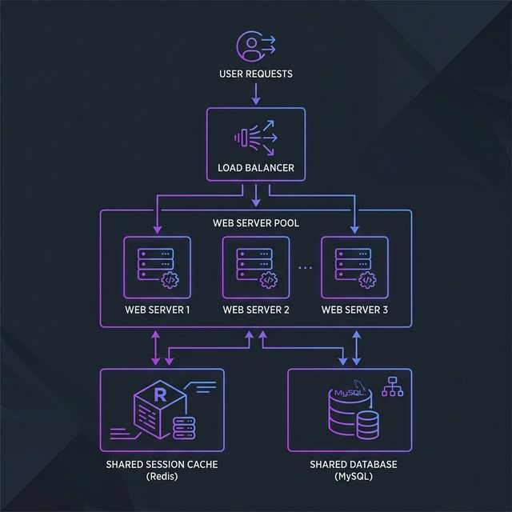

# Stage 7: Stateless Web Tier

With multiple app servers behind a load balancer, you've unlocked horizontal scaling. But there's a hidden time bomb: **state stored inside your app servers**. The moment a server stores anything that belongs to a specific user in its own memory, that user is *tied* to that server forever. This is the **stateful anti-pattern**, and it breaks horizontal scaling.

---

### The Problem: Stateful Servers

A "stateful" server stores **user-specific session data in its own RAM**.

```text
STATEFUL SERVER PROBLEM:

User Alice logs in → Load Balancer routes to Server #1
Server #1 stores Alice's session: { "userId": 1, "cart": [item42] } in its RAM.

Alice clicks "View Cart" → Load Balancer routes to Server #2
Server #2 checks its RAM → NOTHING FOUND [NO]
Result: "You are not logged in."
```

---

### The Solution: Stateless Web Tier

A **stateless web server** stores NO user-specific data locally. Shared state is stored in a central store (Redis).

```text
STATELESS SERVER SOLUTION:

User Alice logs in → Server #1 creates session in Redis.
Returns a "session_token" to Alice's browser.

Alice clicks "View Cart" → Load Balancer routes to Server #2
Server #2 reads the token → queries Redis → [YES] Gets Alice's session.
Result: Seamless experience on ANY server.
```

---

### Architecture Visualized

```text
             [  Load Balancer  ]
              /        |        \
             v         v         v
        +--------+ +--------+ +--------+
        |Server #1| |Server #2| |Server #3|
        |STATELESS| |STATELESS| |STATELESS|  ← No local sessions
        +--------+ +--------+ +--------+
             \         |        /
              \        |       /
               v       v      v
          +----------------------------+
          |   Shared State Store       |
          |   (Redis / Memcached)      |  ← All sessions live here
          +----------------------------+
```



---

### Two Main Approaches for Session Management

#### 1. Server-Side Sessions (Redis)
Client holds a random ID; server-side holds the data in Redis.
- **[YES]** Secure, high capacity, easy to revoke.
- **[NO]** Needs Redis cluster, adds network lookup latency.

#### 2. JWT (JSON Web Token)
Entire session data is cryptographically signed and stored in the client's browser.
- **[YES]** Truly stateless, zero server-side storage, high scalability.
- **[NO]** Cannot be easily revoked, payload is visible to client.

---

### Auto-Scaling payoff
Once stateless, you can use **Auto-Scaling Groups**:
- **Black Friday Surge:** CPU hits 70% → Cloud provider launches 3 more servers automatically.
- **Traffic drops:** Servers are terminated to save money.

---

## Advantages

1. **True Horizontal Scalability:** Add or remove servers without worrying about user sessions.
2. **Dynamic Auto-Scaling:** Automatically scale up for spikes and down to save costs.
3. **Simplified Deployments:** Rolling updates are trivial since servers are interchangeable.
4. **Resiliency:** A crashed server loses no session data (data is in Redis).

---

## Disadvantages

1. **Critical Dependency:** If Redis goes down, authentication fails for all users.
2. **Network Latency:** Every request adds a millisecond for the session lookup.
3. **Complexity:** Requires managing a high-availability state store.

---

### Common HLD Interview Questions

**Q1: Why are stateful servers incompatible with horizontal scaling?**
*Answer:* A load balancer can send a user's next request to any server. If state is local, it won't be found on a different machine.
*Example:* A user logs in on Server A, but when they try to "Checkout," the load balancer sends them to Server B. If state is not shared, Server B will ask the user to log in again, ruining the experience.

**Q2: What is a JWT and how does it enable truly stateless authentication?**
*Answer:* A JWT encodes user details and a signature into a token stored by the client. Servers validate the signature without checking a DB.
*Example:* A "Microservices" architecture uses JWTs so that the "Order Service" can verify a user's ID and role without calling the "Identity Service" for every single request.

**Q3: How does Auto-Scaling work with stateless servers?**
*Answer:* It adds/removes identical servers based on CPU load. Statelessness ensures new servers can handle traffic immediately.
*Example:* A "Ticketing Site" scales from 2 to 50 servers in 2 minutes when a major concert goes on sale. Because they are stateless, no user is logged out as new servers enter the mix.
