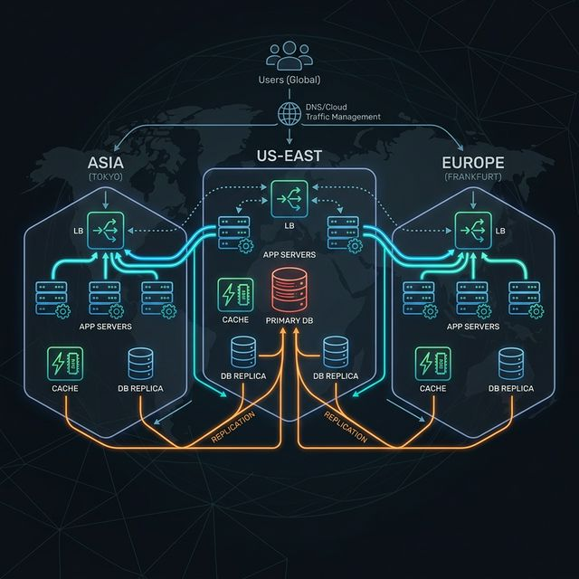

# Stage 8: Data Centers and Geographic Distribution

Your system now handles hundreds of thousands of users efficiently in one region. But what about your users in Tokyo, London, or São Paulo? They're all hitting your servers in Virginia, USA — experiencing 150-300ms of latency just due to the physical distance light travels through undersea fiber optic cables.

And what happens to your entire business if the Virginia data center suffers a power outage? **Your entire system goes dark.**

The solution: **Multi-Region Data Centers**.

---

### The Problem: Single Region Architecture

```text
SINGLE REGION PROBLEM:

User in Mumbai ────────────────────────────────────→ Data Center (Virginia, USA)
                         ~200ms round-trip
                   (light through 14,000 km of fiber)

User in São Paulo ──────────────────────────────────→ Data Center (Virginia, USA)
                         ~180ms round-trip

User in London ──────────────────────────────────────→ Data Center (Virginia, USA)
                         ~100ms round-trip

AND IF Virginia data center has a power outage:
ALL of the above users → DOWN [NO]
```

---

### Multi-Data Center Architecture Visualized

```text
      [ Users in Asia ]    [ Users in US ]   [ Users in Europe ]
              |                   |                   |
              v                   |                   v
    +-----------------+           |         +-----------------+
    | Data Center     |           |         | Data Center     |
    | Asia (Mumbai)   |           |         | Europe (London) |
    |                 |           |         |                 |
    | [Load Balancer] |           |         | [Load Balancer] |
    | [App Servers]   |           v         | [App Servers]   |
    | [Cache (Redis)] | +-------------------+ [Cache (Redis)] |
    | [DB Replica]    | | Data Center       | [DB Replica]    |
    +-----------------+ | US-East (Virginia)|+-----------------+
                        | [Load Balancer]   |
                        | [App Servers]     |
                        | [Cache (Redis)]   |
                        | [PRIMARY DB] ─────┼─── Replicates to other DCs
                        +-------------------+
```



Each data center (DC) has a full stack: Load Balancer, App Servers, Redis Cache, and a DB Replica. Users are routed to the **geographically nearest** data center.

---

### How Traffic Is Routed

#### Geolocation-Based DNS Routing
DNS returns a *different* IP address based on user location.

- **Mumbai User:** Gets Mumbai DC IP.
- **London User:** Gets London DC IP.

#### Anycast Routing
A single IP address is announced from multiple data centers. The internet's BGP protocol routes users to the closest node. Used by Cloudflare and Google Cloud.

---

### Failover Between Data Centers

If a data center goes down, you must route traffic to healthy ones:

- **Normal:** US users hit Virginia [OK].
- **Outage:** Virginia fails. DNS health check detects it and updates. US users hit London [OK] (slower but works).

---

### Database Replication Models

#### Model 1: Single Primary, Multi-Region Replicas
One DC handles all writes; others have read-only replicas. Simple but adds write latency for remote users.

#### Model 2: Multi-Primary (Active-Active)
All data centers accept writes. Extremely fast globally but requires complex conflict resolution.

---

## Advantages

1. **Low Global Latency:** Users hit servers 50km away instead of 10,000km away.
2. **High Availability:** If one entire region goes dark, the others keep the business running.
3. **Disaster Recovery:** Protects against fires, floods, or major power grid failures in one city.
4. **Regulatory Compliance:** Helps keep data in specific regions (e.g., GDPR in the EU).

---

## Disadvantages

1. **Operational Complexity:** Managing 3 full stacks in 3 continents is 3x the work.
2. **Data Sync Challenges:** Replication across oceans takes time, causing lag.
3. **High Cost:** Running idle or active capacity in multiple regions is expensive.
4. **Deployment Difficulty:** Global rollouts require careful orchestration to avoid inconsistency.

---

### Common HLD Interview Questions

**Q1: What is a "data center failover" and what determines the failover time?**
*Answer:* Rerouting traffic from a dead DC to a live one. Time depends on Health Check intervals and DNS TTL.
*Example:* If your DNS TTL is 60 seconds and your health check takes 30 seconds to confirm a failure, it will take roughly 90 seconds for users to start being routed to the backup data center.

**Q2: Difference between Active-Active and Active-Passive multi-region?**
*Answer:* Active-Active serves traffic from all DCs; Active-Passive keeps one DC on standby.
*Example:* A "Worldwide Video App" uses Active-Active to ensure low latency for everyone. A "Bank" might use Active-Passive for simpler data consistency, keeping a "Secondary" site ready strictly for emergencies.

**Q3: How does GeoDNS work, and what are its limitations?**
*Answer:* It maps user IP to a region and returns the closest DC IP. Limitation: DNS caching and VPNs.
*Example:* A user in Germany using a US-based VPN will be routed to the US data center because the DNS server thinks they are physically in America, causing high latency.
